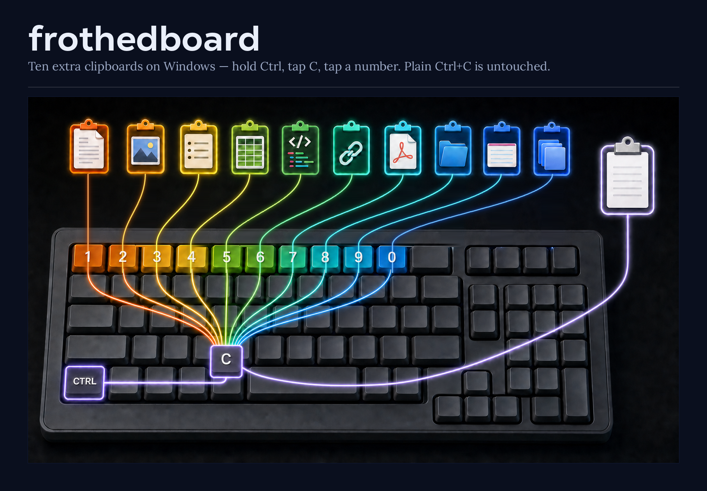

# frothedboard

Why one clipboard when many clipboard do better



Hold **Ctrl**, tap **C**, tap **3** — that copy went to board 3.
Hold **Ctrl**, tap **V**, tap **3** — board 3 comes back.

Ten boards, plus your normal clipboard, untouched. Any digit, top row or numpad. `Ctrl+X` too.
Holds anything you can copy: text, images, files, formatted documents.

Touch no digit and `Ctrl+C` / `Ctrl+V` do exactly what they always did. That's the whole point —
the other numbered clipboards make you learn a second shortcut instead.

## Install

Windows. Grab the zip from [Releases][releases], unpack it anywhere, run `frothedboard.exe`. No
installer, no runtime. It sits in the tray. A folder rather than a lone exe so nothing leaks into
`%TEMP%`.

Portable: nothing is written to disk, ever. Boards are wiped when you quit and don't survive a
restart, on purpose.

## Tested so far

Text copies and pastes through the boards. Cutting files works too, and boards hold their own
payloads independently — 1 and 2 each moved a different set.

Still untried: images, formatted content, and elevated windows (an unelevated hook cannot see
them; run as admin if you need them).

## Build

Microsoft's .NET 8 SDK — Ubuntu's package won't do, it strips WindowsDesktop. Cross-builds from
Linux.

```bash
dotnet test tests/Frothedboard.Core.Tests
dotnet publish src/Frothedboard.App -c Release -r win-x64 --self-contained \
  -p:PublishSingleFile=true -p:EnableCompressionInSingleFile=true -o dist
```

MIT.

[releases]: https://github.com/Obsidiate/frothedboard/releases
