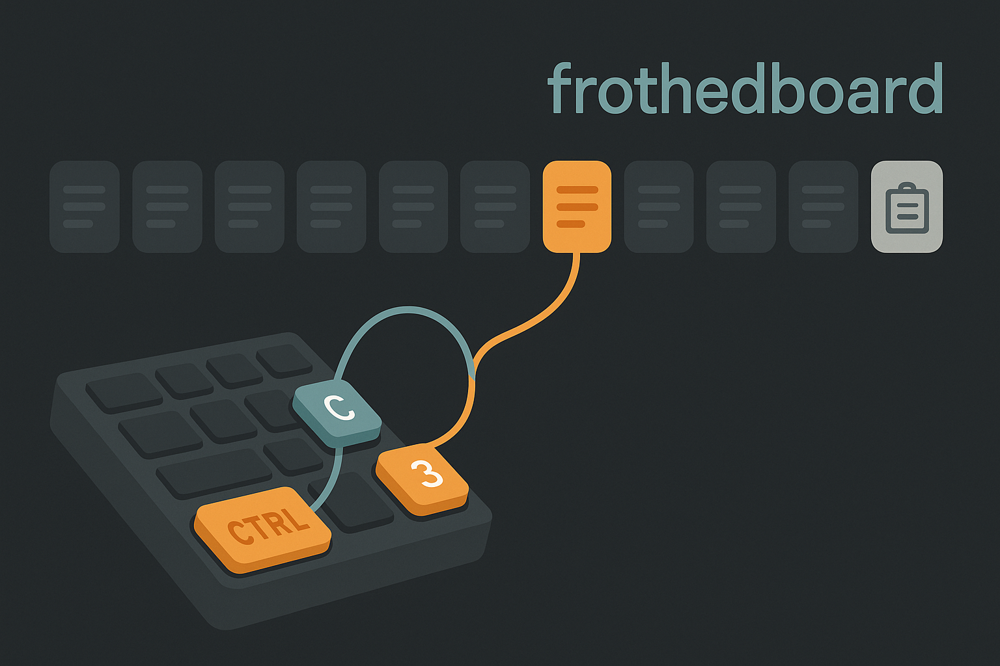

# frothedboard

Why one clipboard when many clipboard do better



Ten more clipboards on top of the one Windows already gives you, reached by a chord that rides on
the shortcut you already use.

Hold **Ctrl**, tap **C**, tap **3**, let go — that copy went to board 3.
Hold **Ctrl**, tap **V**, tap **3**, let go — board 3 comes back.

Any digit works, top row or numpad, so there are ten boards plus the untouched system clipboard.
Eleven places to put things.

**Never touch a digit and Ctrl+C / Ctrl+V behave exactly as they always have.** No new muscle
memory, no added latency, nothing to remember on the days you don't need it.

## Why not just install one of the existing ones

There are plenty of numbered-slot clipboards — [MultiClipBoardSlots][mcbs], [Multi-slot Copy
Paste][mscp], [ClipboardPlusPlus][cpp], [GroggyOtter's AHK class][ahk] — and plenty of clipboard
histories: Ditto, CopyQ, ArsClip, Win+V. Every one of them binds a *separate* shortcut: `Ctrl+1`,
`Ctrl+Alt+Numpad5`, `Ctrl+Shift+C` then a digit. The one script that hooks `Ctrl+C` itself breaks
plain `Ctrl+C` — you have to tap space afterwards to get an ordinary copy.

PowerToys has carried a request for exactly this since 2020 ([#3768][pt1], [#18430][pt2]). It is
still open.

The idea here isn't eleven clipboards. It's that the chord is a *suffix on the real shortcut*, so
the feature costs nothing when you aren't using it.

## How it works

Copy and paste are not symmetric, and only one of them is hard.

**Copy is free.** `Ctrl+C` passes straight through untouched, so an ordinary copy is exactly as
fast as it ever was. A live mirror of the clipboard is kept up to date in the background, so when a
digit arrives while Ctrl is still down, the payload you just overwrote is already in hand: the new
copy goes into the board, the old clipboard goes back. Ctrl+C itself never stops to read anything.

**Paste has to be deferred**, because a paste cannot be taken back. So `Ctrl+V` is swallowed, and
the disambiguator is the **Ctrl release**, not a timer — an ordinary paste fires the instant Ctrl
comes up, which for a human is a few tens of milliseconds. A digit instead means a board.

There is a 2-second backstop for a Ctrl key left physically stuck down. It is deliberately long
rather than a snappy 300 ms: a short timer would fire the ordinary paste, and then paste a *second*
time if you hesitated and then reached for a digit.

A slotted copy leaves the system clipboard alone, so the boards behave like registers rather than
history.

## Status

The chord logic lives in `Frothedboard.Core`, has no Win32 in it at all, and is covered by 29
tests — every transition, both Ctrl keys, both digit rows, held-Ctrl paste bursts, auto-repeat,
`Ctrl+Shift+V` passthrough, and bare `Ctrl+3` still reaching the app so browser tab switching keeps
working.

`Frothedboard.App` is the Win32 shim around it: the keyboard hook, `SendInput`, the clipboard
mirror and the tray icon. **It compiles but has not yet been run on Windows** — it was
cross-compiled from Linux. Things worth checking first on real hardware:

- ordinary Ctrl+C / Ctrl+V feel unchanged in a browser, an editor, Office, Explorer and a terminal
- Ctrl never sticks down after a flush — hammer Ctrl+V without releasing, then mash C, V and digits
- rich content survives a round trip: formatted text, an image, copied files
- elevated windows (an unelevated hook cannot see them; run as admin if you need them)

Only text survives a restart. Images and copied file lists stay in memory for the session, on
purpose — persisting them means writing whatever you happened to copy to disk.

## Install

Grab `frothedboard.exe` and run it. It lives in the tray; right-click for the boards, to pause it,
or to start it with Windows. No installer, no runtime to install.

## Build

Needs Microsoft's .NET 8 SDK. Ubuntu's `dotnet-sdk-8.0` package will not work — it strips
`Microsoft.NET.Sdk.WindowsDesktop`, so use [`dotnet-install.sh`][dotnet] instead.

```bash
dotnet test tests/Frothedboard.Core.Tests
dotnet publish src/Frothedboard.App -c Release -r win-x64 --self-contained \
  -p:PublishSingleFile=true -p:EnableCompressionInSingleFile=true -o dist
```

That produces a standalone ~65 MB exe with the runtime baked in. For a 200 KB one that needs the
[.NET 8 Desktop Runtime][runtime] installed, swap `--self-contained` for `--self-contained false`.

Cross-builds from Linux or macOS; `EnableWindowsTargeting` in the app csproj pulls the Windows ref
packs from NuGet.

## Configuration

Defaults live in `FrothedConfig` — board count, the chord timeouts, how long to wait for a lazy app
to read the clipboard before taking it back, and whether `Ctrl+X` takes the chord too. Boards are
stored in `%LOCALAPPDATA%\frothedboard\`.

## Licence

MIT.

[mcbs]: https://www.ghacks.net/2020/07/04/extend-the-clipboard-with-10-additional-slots-using-multiclipboardslots/
[mscp]: https://github.com/damogranlabs/Multi-slot-Copy-Paste
[cpp]: https://github.com/crdevio/ClipboardPlusPlus
[ahk]: https://github.com/GroggyOtter/AHK_Multi_Clipboard
[pt1]: https://github.com/microsoft/PowerToys/issues/3768
[pt2]: https://github.com/microsoft/PowerToys/issues/18430
[dotnet]: https://dot.net/v1/dotnet-install.sh
[runtime]: https://dotnet.microsoft.com/download/dotnet/8.0/runtime
